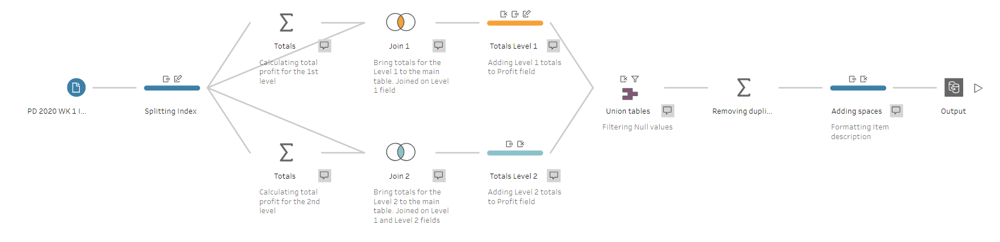

# Preppin' Data 2020: Week 1 solution

Here is the workflow for my solution for the first Preppin’ Data challenge of 2020. The goal for this challenge was to calculate total profits for Level 1 and Level 2 of the profit statement’s hierarchy and add leading spaces to visually highlight different levels of this hierarchy (5 spaces for Level 2 items and 10 spaces for Level 3 items).

Please [visit my website](https://www.prosvetova.com/blog/2020-01-04-preppindata_2020w1) for a step-by-step walk-through of the solution. 

**Techniques used:**

 - Split
 - Join
 - Aggregate
 - Union
 - Removing duplicates
 - String calculations

Reach me at [@Anyalitica](https://twitter.com/Anyalitica) on Twitter