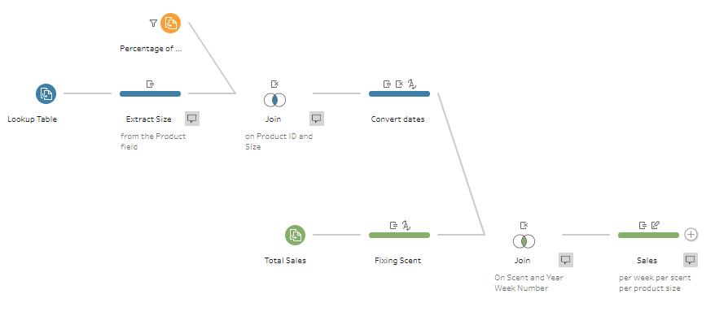

# Preppin' Data 2020: Week 12 solution

Here is my solution for Peppin’ Data 2020, Week 12. This challenge was about calculating weekly sales figures for products based on total sales numbers.

Please [visit my website](https://www.prosvetova.com/blog/2020-03-22-preppindata_2020w12) for a step-by-step walk-through of the solution. 

**Techniques used:**

 - Join
 - Data cleaning
 - Date formatting
 - String calculations

Reach me at [@Anyalitica](https://twitter.com/Anyalitica) on Twitter
