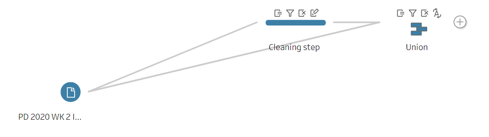

# Preppin' Data 2020: Week 2 solution

Here is my solution for Peppin’ Data 2020, Week 2. The goal for this challenge was to clean and format time entries to make them fit the 24-hour clock.

Please [visit my website](https://www.prosvetova.com/blog/2020-01-12-preppindata_2020w2) for a step-by-step walk-through of the solution. 

**Techniques used:**

 - Regular Expressions
 - String calculations
 - Union

Reach me at [@Anyalitica](https://twitter.com/Anyalitica) on Twitter