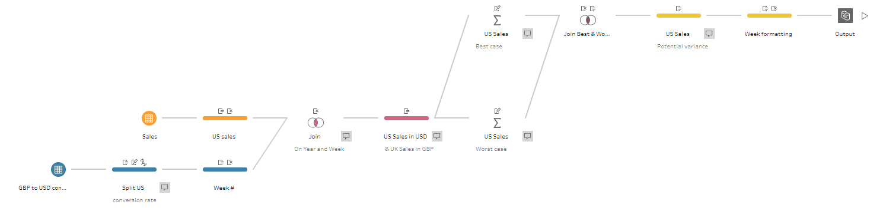

# Preppin' Data 2020: Week 6 solution

Here is my solution for Peppin’ Data 2020, Week 6. This challenge was about conversion rates: identifying the best and the worst exchange rates for each week as well as the weekly variance of sales values.

Please [visit my website](https://www.prosvetova.com/blog/2020-02-18-preppindata_2020w6) for a step-by-step walk-through of the solution. 

**Techniques used:**

 - Split
 - Join
 - Aggregate
 - String calculations

Reach me at [@Anyalitica](https://twitter.com/Anyalitica) on Twitter