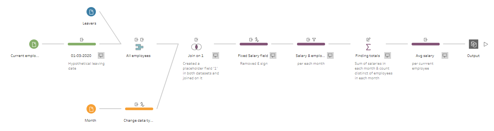

# Preppin' Data 2020: Week 7 solution

Here is my solution for Peppin' Data 2020, Week 7. This week we are looking at how to count existing employees and their aggregated salaries on a monthly basis, taking into consideration people who left the company.

Please [visit my website](https://www.prosvetova.com/blog/2020-02-19-preppindata_2020w7) for a step-by-step walk-through of the solution. 

**Techniques used:**

 - Scaffolding
 - Join
 - Aggregate
 - String calculations

Reach me at [@Anyalitica](https://twitter.com/Anyalitica) on Twitter