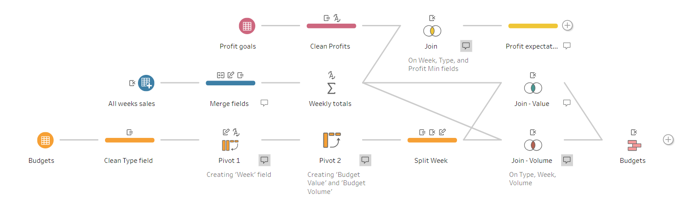

# Preppin' Data 2020: Week 8 solution

Here is my solution for Peppin’ Data 2020, Week 8. The goal for this challenge was to combine several weekly sales reports together, and compare them against budget and profit goals.

Please [visit my website](https://www.prosvetova.com/blog/2020-02-22-preppindata_2020w8) for a step-by-step walk-through of the solution. 

**Techniques used:**

 - Multiple clause join
 - Wildcard union
 - Union
 - Data interpreter
 - Aggregate
 - Pivot
 - Split
 - String calculations

Reach me at [@Anyalitica](https://twitter.com/Anyalitica) on Twitter