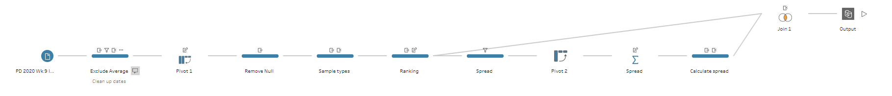

# Preppin' Data 2020: Week 9 solution

Here is my solution for Peppin’ Data 2020, Week 9. In this challenge we looked at US Election poll results from RealClearPolitics.com. The goal for the challenge was to clean and prepare the data so it can be used to visualise poll results as a bump chart in Tableau Desktop.

Please [visit my website](https://www.prosvetova.com/blog/2020-03-04-preppindata_2020w9) for a step-by-step walk-through of the solution. 

**Techniques used:**

 - Rank 
 - Aggregate
 - Pivot
 - Split
 - String calculations

Reach me at [@Anyalitica](https://twitter.com/Anyalitica) on Twitter
