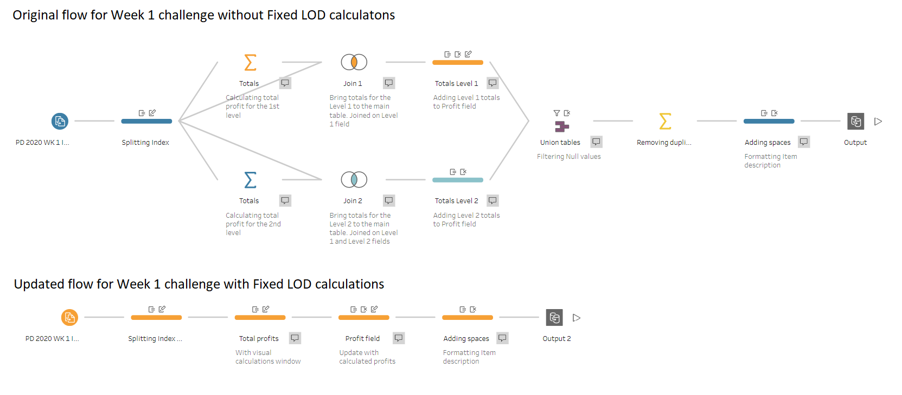

# New feature in Tableau Prep Builder 2020.1: Fixed Level of Detail expressions

Tableau Prep Builder 2020.1 was released last week, and it now supports Fixed Level of Detail (Fixed LOD) calculations, similar to Tableau Desktop. That means that you can use them to change the granularity of fields in your data, or create new fields using the existing data in your dataset. Doing such calculations before bringing the data into Tableau Desktop will improve a dashboard’s performance, especially when working with large datasets.

Please [visit my website](https://www.prosvetova.com/blog/2020-02-29-fixed_lods_in_tableau_prep) to read the blog post where I discuss how to create and edit Fixed LOD calculations in Tableau Prep Builder 2020.1 as well as current limitations of this feature. 

As an example in this post, I'm using [my solution for Preppin’ Data’s 2020 Week 1 challenge](https://github.com/anyalitica/preppin_data_solutions/tree/master/PreppinData_2020_week_1)

Reach me at [@Anyalitica](https://twitter.com/Anyalitica) on Twitter